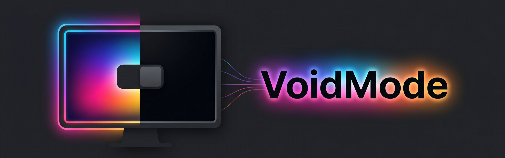
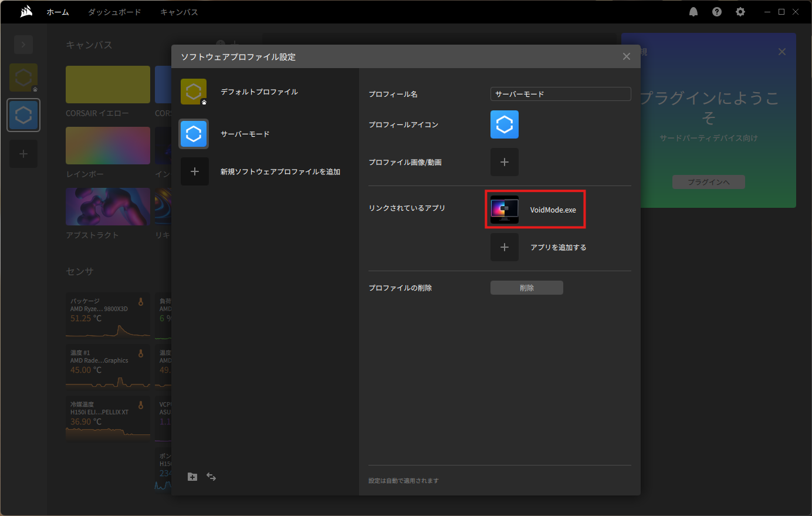
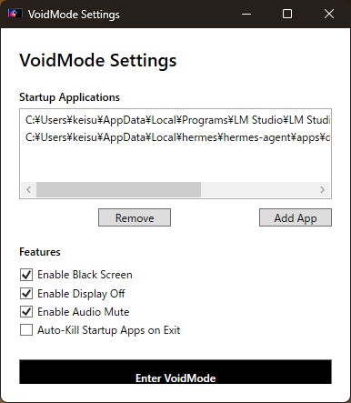

VoidModeは、PCを個人の作業端末として利用する状態から、Hermes AgentやLM StudioなどのAPIサーバーとして利用する状態へスムーズに移行させるためのツールです。サーバーモード移行時に視覚的なノイズ（ライティング）を排除し、ディスプレイの電源をオフにし、音声をミュートすることで、静音かつ省電力なサーバー環境を構築します。

## 主な機能

- **アプリ自動起動**: サーバーモード移行時に、指定したアプリケーション（LM Studio, Hermes Agentなど）を自動的に起動します。
- **ライティング消灯 (プロファイル連携)**: 黒いフルスクリーンウィンドウを最前面に維持することで、ライティングソフト（Chroma, iCUE等）の「アプリ別プロファイル」機能をトリガーし、ライティングを消灯させます。
- **ディスプレイ電源オフ**: Win32 APIを使用してモニターの電源信号をオフにします。
- **オーディオミュート**: システム音量を一時的にミュートし、通常モード復帰時に元のレベルに復元します。
- **プロセス自動終了**: 通常モードへの復帰時に、サーバーモードで起動したアプリケーションを自動的に強制終了させることができます。
- **簡単復帰**: マウス移動やキー入力を検知すると案内が表示され、`Esc` キーと確認ダイアログで簡単に通常モードへ戻ることができます。

## インストール
[最新のリリース](https://github.com/keimag-dev/VoidMode/releases/latest)からインストーラーをダウンロードしてください。
インストーラーのexeファイルをダブルクリックして、画面にしたがって進めるとインストールが完了します。

## ライティングの消灯設定 (事前準備)

VoidMode自体が直接ハードウェアを制御するのではなく、**「VoidModeが最前面にいる時に、ライティングソフト側で消灯プロファイルを適用する」**という仕組みを利用しています。そのため、以下の事前設定が必要です。

1. ライティング制御ソフトで「すべてのLEDをオフにする」というプロファイルを作成します。
2. そのプロファイルを、**`VoidMode.exe` が起動・フォーカスされている時に有効になるよう紐付け**ます。  
  `VoidMode.exe` のパスは、インストール状況によって `C:\Users\<ユーザ名>\AppData\VoidMode\VoidMode.exe` や `C:\Program Files\VoidMode\VoidMode.exe` 等になります。

---

<b>Corsair iCUE の設定方法</b>

1. iCUEを開き、新しいプロファイルを作成します。
2. そのプロファイル内で、すべてのデバイスのライティングを「オフ」に設定します。
3. 「プロファイル」設定から、この消灯プロファイルを `VoidMode.exe` にリンクさせます。
   - `VoidMode.exe` のパスは、インストール状況によって `C:\Users\<ユーザ名>\AppData\VoidMode\VoidMode.exe` や `C:\Program Files\VoidMode\VoidMode.exe` 等になります。

<b>Razer Chroma (Synapse) の設定方法</b>

1. Razer Synapseを開き、「プロファイル」タブから新しいプロファイルを作成します。
2. 「クイックエフェクト」などでライティングをすべてオフにするか、静止色で黒（または暗い色）に設定します。
3. 「リンクされたゲーム」セクションで `VoidMode.exe` を追加し、作成した消灯プロファイルを紐付けます。
   - リンクされたゲームセクションの追加ボタンを押した際にVoidModeが見つからない場合には右上の「参照」をクリックしてVoidModeのexeファイルを追加してください。
   - `VoidMode.exe` のパスは、インストール状況によって `C:\Users\<ユーザ名>\AppData\VoidMode\VoidMode.exe` や `C:\Program Files\VoidMode\VoidMode.exe` 等になります。

---

## セットアップと使い方

### 1. 起動
アプリケーションを起動すると、まず設定画面が開きます。

### 2. 設定
- **Startup Applications**: サーバーモード移行時に起動したい `.exe` ファイルのパスを追加してください。
- **Features**:
    - `Enable Black Screen`: 全画面黒色ウィンドウを表示します（ライティング消灯に必要）。
    - `Enable Display Off`: モニターの電源をオフにします。
    - `Enable Audio Mute`: 音声をミュートにします。
    - `Auto-Kill Startup Apps on Exit`: 復帰時に起動したアプリを自動的に終了します。

### 3. サーバーモードへの移行
「Enter VoidMode」ボタンをクリックすると、設定に基づいた処理が実行され、サーバーモードに移行します。以下のような真っ黒な画面となり、対応するディスプレイではディスプレイ自体の電源が切れます。

### 4. 通常モードへの復帰
1. マウスをクリックするか、キーボードのキーを押します。
2. 画面に「Escキーで通常モードに復帰します」というメッセージが表示されます。
3. `Esc` キーを押すと確認ダイアログが表示されるので、「はい」を選択してください。

## 技術スタック

- **言語**: C# (.NET 8)
- **UIフレームワーク**: WPF (Windows Presentation Foundation)
- **主要ライブラリ**:
    - `NAudio`: Windowsオーディオ制御
    - `Newtonsoft.Json`: 設定ファイルの管理
    - `Win32 API (PInvoke)`: ディスプレイ電源制御およびウィンドウ管理

## ライセンス
このソフトウェアはMITライセンスの下で頒布します。
